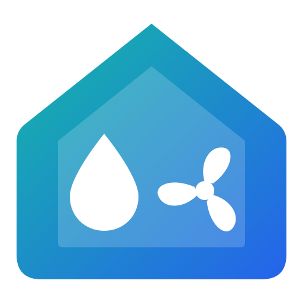

# HomeKit Extended

A Home Assistant custom integration that publishes HomeKit accessories which
Home Assistant's built-in **HomeKit Bridge** can't build. The bridge turns each
entity into its own accessory; this integration combines the entities of one
real-world device into the single HomeKit accessory Apple Home expects.

| Accessory | Built from | What the built-in bridge does instead |
| --- | --- | --- |
| **Irrigation System** | Valves, one per zone | A separate accessory per valve, with no zones, run-all or sequencing |
| **Ceiling Fan** | A fan and a light | Two separate tiles |
| **Buttons / Remote** | `event` entities | Doesn't support the `event` domain at all |
| **Multi-Sensor** | Motion, occupancy, contact, leak, temperature, humidity, light level and battery sensors | A separate accessory per sensor |
| **Air Quality Monitor** | AQI, PM2.5, PM10, VOC, NO₂, O₃, SO₂ and CO₂ sensors | A separate accessory per pollutant |
| **Air Purifier** | A fan plus optional sensors | Has an air purifier type, but without a linked Fan service, swing mode or AQI input |
| **Power Strip** | Switches | A separate accessory per switch |
| **Shower / Faucet** | Valves, one per outlet | A separate accessory per valve |

Each accessory runs next to the HomeKit Bridge integration, not inside it, with
its own port and pairing code.

## Installation

### HACS

[](https://my.home-assistant.io/redirect/hacs_repository/?owner=bisman-automations&repository=ha-homekit-extended&category=integration)

Click the button above, then install **HomeKit Extended** and restart Home
Assistant. Or add it by hand:

1. In HACS, open the menu and choose **Custom repositories**.
2. Add `https://github.com/bisman-automations/ha-homekit-extended` with the category
   **Integration**.
3. Install **HomeKit Extended**, then restart Home Assistant.

Requires Home Assistant 2025.3 or later.

### Manual

Copy `custom_components/homekit_extended` into your Home Assistant
`config/custom_components/` folder, then restart.

## Adding an accessory

1. Go to **Settings → Devices & services → Add integration → HomeKit Extended**
   and pick the kind of accessory.
2. **Pick the device** it represents, such as your sprinkler controller, ceiling
   fan, or Aqara sensor. Its matching entities are filled in for you on the next
   step, and the accessory is named after the device. You can also skip the
   device and choose entities yourself.
3. Check the entities, and for irrigation set each zone's run time.
4. A notification appears with a **pairing QR code**. In Apple Home, choose
   **Add Accessory** and scan it. The notification disappears once the accessory
   is paired.

The port and pairing code are chosen automatically. Change them under
**Connection** on the first step if you need to.

### Managing accessories

Each accessory gets a device page under HomeKit Extended with a **Paired**
sensor, so you can see at a glance which ones are added to Apple Home. Choose
**Configure** on the entry to:

- **Entities.** Change which entities the accessory mirrors.
- **Run times** (irrigation and shower). Set each zone's run time. This applies
  right away, without re-pairing.
- **Accessory information.** Set the manufacturer, model, serial number and
  firmware shown in Apple Home. Any field left empty uses the details of the
  device the accessory represents: the device you picked during setup, or the
  device of its entities. For a zone device under a controller (like Rain Bird
  zones), the controller's details are used, and its MAC address stands in for
  a missing serial number. The screen shows what each empty field will use, and
  changes apply without re-pairing.
- **Port and pairing code.**
- **Pairing.** Show the QR code again, or reset pairing so the accessory can be
  added to a different home.

Rename an accessory by renaming its entry. Diagnostics, including the accessory
exactly as HomeKit sees it, can be downloaded from the entry's menu.

## Irrigation System

Publishes one **Irrigation System** with a **Valve** zone for each selected
valve, named after the valve. Everything below uses HomeKit's own irrigation
controls; nothing extra appears in Apple Home.

- **Per-zone run times.** Each zone runs for its own run time, up to 3600
  seconds (HomeKit's limit), then closes itself. A run time of 0 runs until you
  stop it. Run times changed in Apple Home are saved, so they survive restarts.
- **Run all zones.** Turning the Irrigation System on runs every enabled zone in
  turn. The system shows the time left for the whole run. Stopping a zone moves
  on to the next, and turning the system off ends the run.
- **Enable or disable zones** in each zone's settings in Apple Home. Disabled
  zones are skipped when running all zones, and the choice is saved.
- **One zone at a time** (on by default). Starting a zone closes the one already
  running, for systems without the water pressure to run two.
- **Pump or master valve** (optional). A switch or valve that's on while any zone
  runs and turns off 5 seconds after the last one, so it doesn't cycle between
  zones. It isn't added to Apple Home.
- **Faults.** A zone whose valve is unavailable shows a fault in Apple Home.
- **Controller run times and countdowns.** When a valve's device also has a
  run-time number and a time-remaining sensor, Apple Home uses those instead,
  and the controller ends each run. [Rain Bird Extended](https://github.com/bisman-automations/ha-rainbird-extended)
  adds both to every Rain Bird zone; pick the Rain Bird controller during
  setup and all of its zones are found. Turn this off with **Use the
  controller's run times and countdown**.
- **Changes outside HomeKit**, for example from an automation or the controller
  itself, are mirrored to Apple Home.

## Shower / Faucet

Works like irrigation but shows as a **Shower** or **Faucet** with one outlet
per valve. Turning it on opens every enabled outlet. Each outlet can have a run
time; the default of 0 runs until stopped.

## Ceiling Fan

A **Fan** with a linked **Light**. Speed, oscillation and direction are added
when the fan supports them, and brightness when the light does.

## Buttons / Remote

Each `event` entity becomes a **programmable button** you can use in Apple Home
automations, with single, double and long press. Several event entities make one
multi-button remote. If one entity covers a whole remote, with event types like
`button_1_single` and `button_2_hold`, each physical button becomes its own
HomeKit button (for example, "Scene Controller Button 1"). Presses are recognized from the event types the device
reports. For example, Hue's `short_release` is a single press and `long_press`
is a long press; other events are ignored. An entity that reports no event types
treats every event as a single press.

## Multi-Sensor

Any mix of motion, occupancy, contact, leak, temperature, humidity, light level
and battery as one accessory. Battery at 20% or less shows as low in Apple Home.

## Air Quality Monitor

One **Air Quality** sensor that carries every pollutant reading you select. The
overall rating is the worst individual pollutant, or comes from an AQI sensor if
you pick one. CO₂ also appears as a **Carbon Dioxide** sensor that alerts at
1000 ppm. Densities are in µg/m³ and CO₂ is in ppm.

## Air Purifier

Publishes one **Air Purifier** accessory backed by a fan entity, with linked
services:

| HomeKit service | Source | Notes |
| --- | --- | --- |
| Air Purifier | Fan | Power, speed (`fan.set_percentage`), swing (`fan.oscillate`), and auto mode through a preset named `auto` |
| Fan | Fan | Linked so Apple Home shows fan controls on the purifier |
| Air Quality | Air quality sensor or PM2.5 sensor | Accepts a HomeKit 1–5 value or an AQI value; if only PM2.5 is set, quality is estimated from it |
| Humidity | Humidity sensor | Optional |
| Temperature | Temperature sensor | Optional; converted to °C |
| Filter Maintenance | Filter life sensor (%) | Optional; asks for a replacement at 10% or less |

## Power Strip

Switches or input booleans as the numbered outlets of one **Outlet** accessory.

## Re-pairing

Apple Home caches an accessory's structure. If you add or remove sensors or
zones, you may need to remove the accessory from Apple Home and add it again. A
reset is available under **Configure → Pairing**.

## Tips

- **Avoid duplicates.** Leave these entities out of the built-in HomeKit
  Bridge's filter, or Apple Home will show them twice.
- **Watch for port conflicts.** The setup flow rejects ports already used by
  another accessory or bridge, including the old standalone integrations, or
  that something else on the host is listening on. If a port becomes busy
  later, the entry shows "Retrying setup" until the port is free.
- **Shorter names when discovered.** By default an accessory is advertised as
  "Irrigation System 8D111D": pyhap adds part of the accessory's ID so names
  never clash. Turn on **Advertise without ID suffix** under Connection to
  advertise just "Irrigation System". If another device already uses that name,
  the suffix is kept.
- **Networking follows Home Assistant.** Accessories are advertised on the
  interfaces chosen under **Settings → System → Network**.

## Moving from homekit-air-purifier or homekit-irrigation

This integration replaces both standalone integrations.

1. Delete the old integration's entries, then remove it in HACS.
2. Remove the old accessories from Apple Home.
3. Add them again here. Pairing can't be carried over, because the pairing
   state is stored per integration.

## Icon

The integration ships its own icon in `custom_components/homekit_extended/brand/`.
Home Assistant 2026.3 and later shows it on the integration card; older versions
show a placeholder. The source artwork is `assets/icon.svg`.

## Development

```bash
python -m venv .venv && . .venv/bin/activate
pip install -r requirements_test.txt ruff
pytest
ruff check custom_components tests && ruff format --check custom_components tests
```

The tests run against a real Home Assistant core through
`pytest-homeassistant-custom-component`. One test also starts the real HAP
server on a local socket.

## License

MIT. See [LICENSE](LICENSE).
